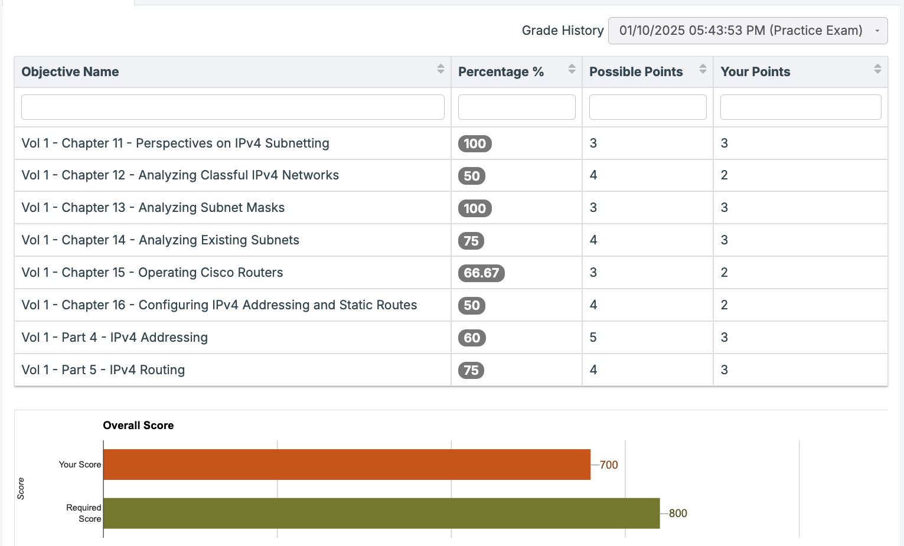

## OSPF 30 questions
Barely 80%

#### Wrong question notes
- Routing protocols admin distance ordering
- Cmd to "disable the OSPF process temporarily"
- Cost calculation -> [ref note](../../../note/Cross-LAN/OSPFv2/COST_CALCULATION.md)
- Reserved multicast IP number -> https://www.iana.org/assignments/multicast-addresses/multicast-addresses.xhtml
- OSPF process ID range [1 to 65,535] -> 0 is NOT valid

## IPv4 30 questions
Takeaways:
- IP calculation takes time!
- Reading book is helpful, ch11 got full marks

#### Wrong question notes
- Each LAN broadcast domain needs a separate subnet, so that `/24` might not be better than `/27`!
- Cmd to configure router subinterface VLAN misses a key word
- Broadcast IP is the last IP in the subnet, could be `.159.255` instead of `.128.255`, ie the middle octet could be larger than the middle octet in the subnet ID!
- Loacl IPv4 route always have mask 255.255.255.255
- Class C network details
- Exact IP ranges of A,B,C classes
- static IP route uses subnet mask instead of wildcard mask
- 225.16.102.232, the first octet means that the address is a multicast (Class D) address and cannot be assigned to an interface as a unicast IP address
- 0.102.62.1, the first octet is 0, which is a reserved value

